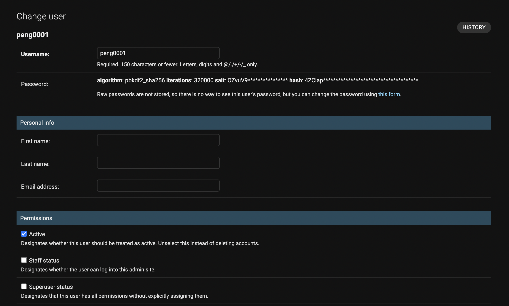

# 派車系統

## 使用者註冊
* [後端入口](https://pppppeng.pythonanywhere.com/admin/)
* 登入後點擊 User 旁的 `add`

* 依照規定格式建立使用者帳號密碼
* 輸入個人詳細資訊
* Permissions 為使用者權限

---

建立完使用者後還需建立使用者憑證
* 後點擊 token 旁的 add

* 選擇剛剛建立的使用者後save
 

這樣就註冊成功了